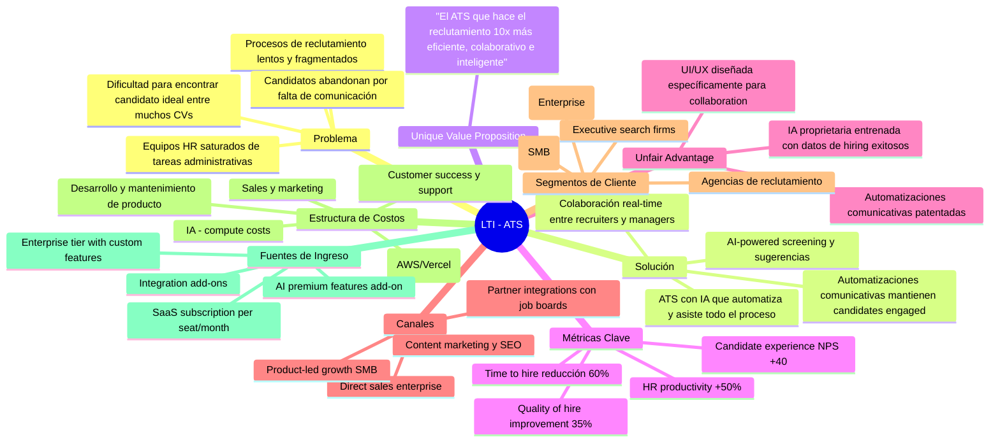
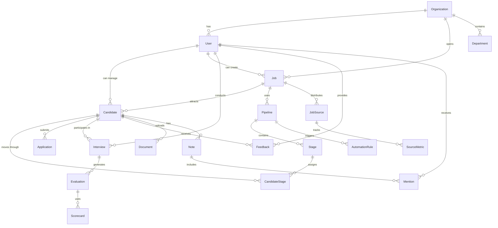
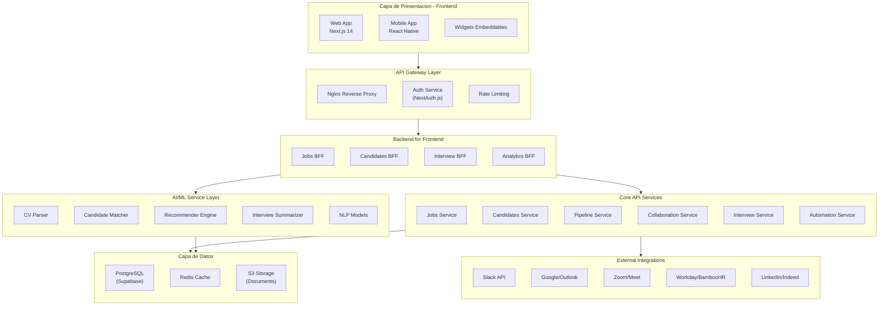
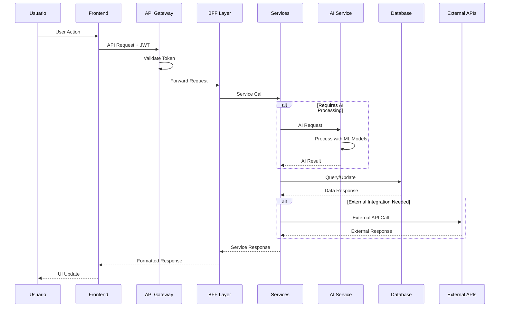
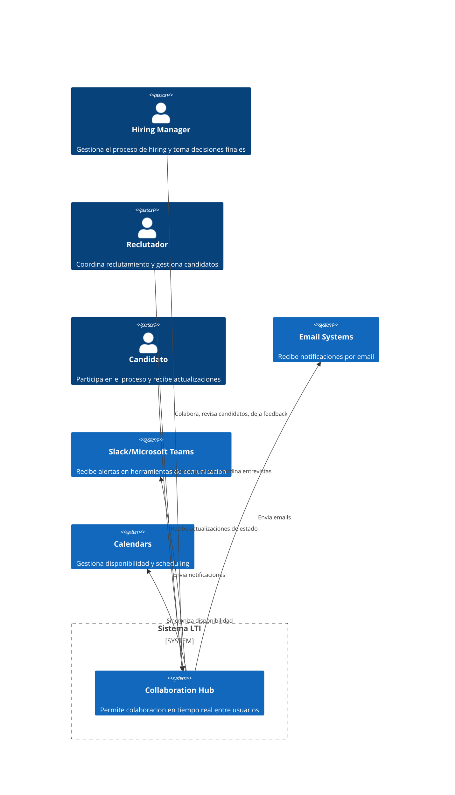
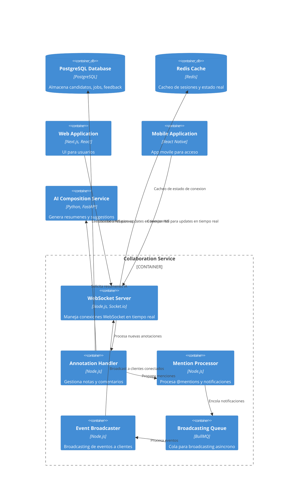
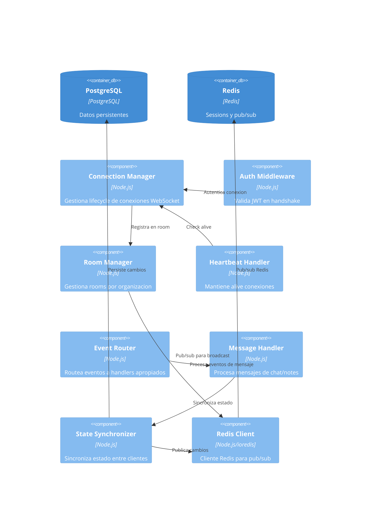

# LTI - Sistema ATS (Applicant Tracking System)

## Documento de Diseño del Producto v1.0

---

## 1. Descripción del Producto, Valor Añadido y Ventajas Competitivas

### 1.1 Descripción del Producto

**LTI (Lead Talent Intelligence)** es un Applicant Tracking System de próxima generación diseñado para transformar la manera en que las organizaciones contratan talento. Construido sobre una arquitectura moderna con T3 Stack (TypeScript/React/Node.js), LTI combina eficiencia operativa, colaboración en tiempo real, automatizaciones inteligentes y asistencia de IA para crear el proceso de reclutamiento más ágil y efectivo del mercado.

### 1.2 Propuesta de Valor

LTI se posiciona como el ATS que **no solo gestiona candidatos, sino que actúa como un asistente inteligente del equipo de recursos humanos**, reduciendo significativamente la carga operativa mientras mejora la calidad de las contrataciones.

### 1.3 Ventajas Competitivas

| Ventaja | Descripción | Impacto |
|---------|-------------|--------|
| **Eficiencia XR** | Reducción del 60% en tiempo de cribado inicial gracias a IA | HR fokus en estrategia, no en tareas administrativas |
| **Colaboración en Tiempo Real** | Panel unificado donde reclutadores y managers trabajan juntos | Decisiones más rápidas y sincronizadas |
| **Automatización Comunicativa** | Workflows automatizados que mantienen a candidatos informados | Experiencia de candidato superior, menor abandono |
| **IA Asistencial** | Asistente IA que sugiere, rankea y predice compatibilidad | Mejora en calidad de contratación, reducción de sesgo |

### 1.4 Diferenciadores Clave vs Competencia

- **Vs. Workday/Greenhouse**: Interfaz más intuitiva, IA más avanzada y accesible para SMB
- **Vs. Lever/Ashby**: Mayor enfoque en automatizaciones comunicativas y colaboración
- **Vs. SAP SuccessFactors**: Arquitectura moderna cloud-native, implementación más rápida

---

## 2. Funciones Principales

### 2.1 Módulo de Gestión de Empleos (Job Management)

- **Creación de puestos**: Plantillas inteligentes con sugerencias IA de requisitos
- **Publicación multidistribución**: Integración con LinkedIn, Indeed, Glassdoor, Job Boards propios
- **Tracking de rendimiento por fuente**: Métricas de conversión por canal de reclutamiento
- **Gestión de departamentos y ubicaciones**: Estructura organizativa configurable

### 2.2 Módulo de Reclutamiento y Cribado (Recruitment & Screening)

- **Portal de candidato optimizado**: Aplicación móvil-first con carga rápida
- **Formularios dinámicos**: Creación sin código de formularios según posición
- **Cribado IA**: Ranking automático de candidatos por compatibilidad
- **Detección de duplicados**: Identificación automática de candidatos previos
- **Evaluación de soft skills por video**: Análisis automático de respuestas en video

### 2.3 Módulo de Pipeline y Kanban (Pipeline Management)

- **Vistas Kanban personalizables**: Drag & drop por etapa del proceso
- **Múltiples flujos por posición**: Diferentes pipelines para diferentes roles
- **Automation rules**: Triggers basados en acciones y timing
- **Notas y feedback estructurado**: Evaluaciones estandarizadas por etapa

### 2.4 Módulo de Colaboración (Collaboration Hub)

- **Panel unificado en tiempo real**: Donde managers ven progreso y candidatos
- **Comentarios y menciones**: @menciones a compañeros en cualquier candidato
- **Entrevistas coordinadas**: Calendarización integrada con disponibilidad
- **Decisiones de hiring team**: Votación y feedback estructurado

### 2.5 Módulo de Entrevistas (Interview Management)

- **Scheduling inteligente**: Búsqueda de slots disponibles automática
- **Videoentrevistas integradas**: Zoom/Google Meet embebido
- **Evaluación post-entrevista**: Formularios estructurados por entrevistadores
- **Scorecards personalizables**: Por rol y nivel organizacional

### 2.6 Módulo de Automatizaciones (Automation Engine)

- **Workflows visuales**: Constructor sin código de secuencias
- **Actions triggers**: Email, cambio de estado, asignación de tareas, integraciones
- **Candidate communication**: Plantillas personalizadas por etapa
- **Candidate portal**: Autoactualización de estado, scheduling self-service

### 2.7 Módulo de IA Asistencial (AI Assistant)

- **CV parsing inteligente**: Extracción y estructuración automática
- **Sugerencias de compatibilidad**: Matching IA con requisitos del puesto
- **Generación de preguntas**: Preguntas de entrevista por competencias
- **Resumen de candidatos**: Executive summary de perfil
- **Predicción de éxito**: Scoring predictivo basado en datos históricos
- **Writing assistant**: Reescritura de emails y comunicaciones

### 2.8 Módulo de Reporting y Analytics

- **Dashboard customizable**: KPIs de reclutamiento en tiempo real
- **Time to hire analytics**: Métricas de identificación de bottlenecks
- **Cost per hire**: Cálculo automático por fuente y posición
- **Diversity metrics**: Tracking de diversidad y compliance
- **Predictive analytics**: Forecasting de necesidades de talento

### 2.9 Módulo de Integraciones

- **HRIS/Payroll**: Workday, SAP, BambooHR, Gusto, ADP
- **Communication**: Slack, Microsoft Teams, clientes de email
- **Calendar**: Google Calendar, Outlook, iCal
- **Video**: Zoom, Google Meet, Microsoft Teams
- **Assessment tools**: Pymetrics, Hogan, Criteria Corp
- **APIs REST/GraphQL**: Webhooks e integraciones custom

---

## 3. Lean Canvas



### Versión en Formato Tabla

| Bloque | Descripción |
|--------|-------------|
| **Problema** | Procesos lentos y fragmentados; candidatos abandonan por falta de comunicación; equipos HR saturados; dificultad para encontrar candidato ideal |
| **Solución** | ATS con IA que automatiza y asiste; automatizaciones comunicativas; colaboración real-time; AI-powered screening |
| **UVP** | "El ATS que hace el reclutamiento 10x más eficiente, colaborativo e inteligente" |
| **Métricas Clave** | Time to hire -60%; Candidate NPS +40; HR productivity +50%; Quality of hire +35% |
| **Unfair Advantage** | IA proprietaria; automatizaciones patentadas; UI/UX colaborativa única |
| **Canales** | Direct sales; PLG; Partners; Content marketing |
| **Segmentos** | SMB 50-500; Enterprise 500+; Agencias; Executive search |
| **Estructura de Costos** | Desarrollo, infraestructura, customer success, sales/marketing, AI compute |
| **Ingresos** | SaaS per seat; Enterprise tier; Integrations; AI premium |

---

## 4. Casos de Uso Principales

### Caso de Uso 1: Publicación de Posición y Reclutamiento Activo

```mermaid
useCaseDiagram
    direction TB
    
    actor "HR Manager" as HR
    actor "Hiring Manager" as HM
    actor "Sistema IA" as IA
    actor "Job Boards" as JB
    
    rectangle "Modulo Jobs" {
        usecase "Crear posicion" as UC1
        usecase "Configurar flujo de seleccion" as UC2
        usecase "Publicar en job boards" as UC3
    }
    
    rectangle "Modulo IA" {
        usecase "Sugerir requisitos" as UC4
        usecase "Generar descripcion" as UC5
    }
    
    rectangle "Modulo Analytics" {
        usecase "Trackear metricas" as UC6
    }
    
    HR --> UC1
    UC1 ..> UC4 : extends
    UC4 --> IA
    UC1 ..> UC5 : extends
    UC5 --> IA
    HR --> UC2
    HM --> UC2
    HR --> UC3
    UC3 --> JB
    JB --> UC6
    
    note right of UC4
      El sistema IA analiza trends
      del mercado y sugiere
      salary y requirements
    end note
```

**Descripción Detallada**:

El caso de uso comienza cuando un HR Manager necesita crear una nueva posición. El sistema presenta plantillas inteligentes basadas en posiciones similares previas y el módulo de IA sugiere requisitos actualizados según el mercado laboral actual. El Hiring Manager participa en la configuración del flujo de selección, definiendo las etapas necesarias. Una vez publicada la posición, el sistema distribuye automáticamente a los job boards configurados, mientras el módulo de analytics comienza a trackear el rendimiento de cada fuente.

### Caso de Uso 2: Cribado y Evaluación de Candidatos con IA

```mermaid
useCaseDiagram
    direction TB
    
    actor "Reclutador" as R
    actor "Candidato" as C
    actor "Sistema IA" as IA
    actor "Hiring Manager" as HM
    
    rectangle "Modulo Screening" {
        usecase "Recibir aplicacion" as UC1
        usecase "Parsear CV" as UC2
        usecase "Ranking IA" as UC3
        usecase "Solicitar info adicional" as UC4
    }
    
    rectangle "Modulo Candidate" {
        usecase "Aplicar a posicion" as UC5
        usecase "Completar formulario" as UC6
    }
    
    rectangle "Modulo Collaboration" {
        usecase "Revisar candidatos" as UC7
        usecase "Dejar feedback" as UC8
    }
    
    C --> UC5
    UC5 --> UC1
    UC1 --> UC2
    UC2 --> UC3
    UC3 ..> UC4 : extends
    UC4 ..> UC6
    UC6 --> IA
    
    R --> UC7
    UC7 --> UC8
    UC8 --> UC3
    
    HM --> UC7
    HM --> UC8
    
    note right of UC3
      El sistema IA rankea candidatos
      basandose en compatibilidad
      con requisitos y cultura
    end note
```

**Descripción Detallada**:

El candidato aplica a través del portal optimizado. El sistema parsea automáticamente su CV, extrae competencias y experiencia, y genera un perfil estructurado. La IA evalúa la compatibilidad con los requisitos del puesto y genera un ranking inicial. Para candidatos en zona gris, el sistema puede solicitar información adicional o generar preguntas específicas. Los reclutadores y hiring managers acceden al panel unificado donde pueden revisar, comentar y dejar feedback estructurado.

### Caso de Uso 3: Gestión de Entrevistas y Decisión de Hiring

```mermaid
useCaseDiagram
    direction TB
    
    actor "Reclutador" as R
    actor "Entrevistador" as E
    actor "Candidato" as C
    actor "Hiring Manager" as HM
    actor "Sistema IA" as IA
    
    rectangle "Modulo Entrevistas" {
        usecase "Schedule entrevista" as UC1
        usecase "Coordinar disponibilidad" as UC2
        usecase "Conectar video" as UC3
    }
    
    rectangle "Modulo Evaluacion" {
        usecase "Completar evaluacion" as UC4
        usecase "Agregar scorecard" as UC5
        usecase "Generar reporte IA" as UC6
    }
    
    rectangle "Modulo Decision" {
        usecase "Recomendar decision" as UC7
        usecase "Votar equipo" as UC8
        usecase "Emitir oferta" as UC9
    }
    
    R --> UC1
    UC1 --> UC2
    UC2 --> UC3
    C --> UC3
    
    E --> UC4
    UC4 --> UC5
    UC5 --> UC6
    UC6 --> IA
    
    HM --> UC7
    R --> UC7
    UC7 --> UC8
    UC8 --> UC9
    
    note right of UC6
      IA genera resumen
      de entrevistas y
      sugiere decision
    end note
```

**Descripción Detallada**:

El reclutador programa entrevistas coordinando disponibilidad de candidato y entrevistadores. El sistema automáticamente encuentra slots comunes y envía invitaciones. Las entrevistas se realizan desde la plataforma con integración de video. Los entrevistadores completan evaluaciones estructuradas con scorecards. La IA analiza todas las evaluaciones y genera un reporte consolidado con recomendación. El equipo de hiring participa en el proceso de decisión con votación estructurada. Finalmente, el sistema gestiona la oferta automáticamente.

---

## 5. Modelo de Datos

### 5.1 Diagrama de Entidades



### 5.2 Definición de Entidades y Atributos

| Entidad | Atributo | Tipo | Descripción |
|---------|----------|------|-------------|
| **Organization** | id | UUID | Identificador único |
| | name | VARCHAR(255) | Nombre de la empresa |
| | domain | VARCHAR(255) | Dominio de email corporativo |
| | plan | ENUM | Plan activo (free/pro/enterprise) |
| | createdAt | TIMESTAMP | Fecha de creación |
| **User** | id | UUID | Identificador único |
| | organizationId | UUID | FK a Organization |
| | email | VARCHAR(255) | Email único |
| | name | VARCHAR(255) | Nombre completo |
| | role | ENUM | Rol (admin/recruiter/hiring_manager/interviewer) |
| | avatarUrl | VARCHAR(500) | URL del avatar |
| | departmentId | UUID | FK a Department |
| | isActive | BOOLEAN | Estado del usuario |
| **Department** | id | UUID | Identificador único |
| | organizationId | UUID | FK a Organization |
| | name | VARCHAR(255) | Nombre del departamento |
| | parentId | UUID | FK auto-referencia (jerarquía) |
| **Job** | id | UUID | Identificador único |
| | organizationId | UUID | FK a Organization |
| | title | VARCHAR(255) | Título del puesto |
| | description | TEXT | Descripción completa |
| | requirements | JSONB | Requisitos estructurados |
| | location | VARCHAR(255) | Ubicación |
| | type | ENUM | Tipo (full-time/part-time/contract) |
| | remote | ENUM | Modalidad (onsite/hybrid/remote) |
| | salaryMin | INTEGER | Salario mínimo |
| | salaryMax | INTEGER | Salario máximo |
| | status | ENUM | Estado (draft/open/paused/closed) |
| | createdBy | UUID | FK a User |
| | hiringManagerId | UUID | FK a User |
| | createdAt | TIMESTAMP | Fecha de creación |
| **Pipeline** | id | UUID | Identificador único |
| | jobId | UUID | FK a Job |
| | name | VARCHAR(255) | Nombre del pipeline |
| | isDefault | BOOLEAN | Pipeline por defecto |
| **Stage** | id | UUID | Identificador único |
| | pipelineId | UUID | FK a Pipeline |
| | name | VARCHAR(255) | Nombre de etapa |
| | order | INTEGER | Orden en el pipeline |
| | isInterviewStage | BOOLEAN | Es etapa de entrevista |
| | color | VARCHAR(7) | Color hexadecimal |
| **Candidate** | id | UUID | Identificador único |
| | organizationId | UUID | FK a Organization |
| | email | VARCHAR(255) | Email del candidato |
| | firstName | VARCHAR(255) | Nombre |
| | lastName | VARCHAR(255) | Apellido |
| | phone | VARCHAR(50) | Teléfono |
| | location | VARCHAR(255) | Ubicación |
| | resumeUrl | VARCHAR(500) | URL del CV |
| | linkedinUrl | VARCHAR(500) | URL de LinkedIn |
| | parsedData | JSONB | Datos parseados del CV |
| | aiScore | FLOAT | Score de compatibilidad IA |
| | tags | JSONB | Etiquetas personalizadas |
| | source | VARCHAR(255) | Fuente de reclutamiento |
| | createdAt | TIMESTAMP | Fecha de creación |
| **CandidateStage** | id | UUID | Identificador único |
| | candidateId | UUID | FK a Candidate |
| | stageId | UUID | FK a Stage |
| | movedBy | UUID | FK a User |
| | movedAt | TIMESTAMP | Fecha de movimiento |
| | comment | TEXT | Comentario del movimiento |
| **Application** | id | UUID | Identificador único |
| | candidateId | UUID | FK a Candidate |
| | jobId | UUID | FK a Job |
| | status | ENUM | Estado (pending/screening/rejected/offered/hired) |
| | appliedAt | TIMESTAMP | Fecha de aplicación |
| **Interview** | id | UUID | Identificador único |
| | candidateId | UUID | FK a Candidate |
| | stageId | UUID | FK a Stage |
| | scheduledBy | UUID | FK a User |
| | interviewerId | UUID | FK a User |
| | scheduledAt | TIMESTAMP | Fecha programada |
| | duration | INTEGER | Duración en minutos |
| | type | ENUM | Tipo (phone/video/onsite) |
| | meetingUrl | VARCHAR(500) | URL de meeting |
| | status | ENUM | Estado (scheduled/completed/cancelled) |
| **Evaluation** | id | UUID | Identificador único |
| | interviewId | UUID | FK a Interview |
| | evaluatorId | UUID | FK a User |
| | overallScore | INTEGER | Score general (1-5) |
| | strengths | TEXT | Fortalezas observadas |
| | concerns | TEXT | Preocupaciones |
| | recommendation | ENUM | Recomendación (strong_yes/yes/no/strong_no) |
| | comments | TEXT | Comentarios adicionales |
| **Scorecard** | id | UUID | Identificador único |
| | stageId | UUID | FK a Stage |
| | name | VARCHAR(255) | Nombre del scorecard |
| | criteria | JSONB | Criterios de evaluación |
| **Note** | id | UUID | Identificador único |
| | candidateId | UUID | FK a Candidate |
| | authorId | UUID | FK a User |
| | content | TEXT | Contenido de la nota |
| | visibility | ENUM | Visibility (private/team) |
| | mentions | JSONB | Usuarios mencionados |
| | createdAt | TIMESTAMP | Fecha de creación |
| **AutomationRule** | id | UUID | Identificador único |
| | organizationId | UUID | FK a Organization |
| | name | VARCHAR(255) | Nombre de la regla |
| | triggerType | ENUM | Tipo de trigger |
| | conditions | JSONB | Condiciones |
| | actions | JSONB | Acciones a ejecutar |
| | isActive | BOOLEAN | Estado activo |
| **JobSource** | id | UUID | Identificador único |
| | jobId | UUID | FK a Job |
| | source | VARCHAR(255) | Job board/source name |
| | externalUrl | VARCHAR(500) | URL externa |
| | isActive | BOOLEAN | Estado activo |
| **Document** | id | UUID | Identificador único |
| | candidateId | UUID | FK a Candidate |
| | type | ENUM | Tipo (resume/cover_letter/certificate) |
| | url | VARCHAR(500) | URL del documento |
| | uploadedAt | TIMESTAMP | Fecha de upload |

### 5.3 Relaciones Detalladas

| Relación | Tipo | Descripción |
|-----------|------|-------------|
| Organization - User | One-to-Many | Una organización tiene múltiples usuarios |
| Organization - Job | One-to-Many | Una organización publica múltiples puestos |
| User - Candidate | One-to-Many | Un usuario gestiona múltiples candidatos |
| Job - Candidate | One-to-Many | Un puesto recibe múltiples candidatos |
| Job - Pipeline | One-to-Many | Un puesto usa un pipeline |
| Pipeline - Stage | One-to-Many | Un pipeline tiene múltiples etapas |
| Candidate - CandidateStage | One-to-Many | Un candidato pasa por múltiples stages |
| Candidate - Interview | One-to-Many | Un candidato tiene múltiples entrevistas |
| Interview - Evaluation | One-to-One | Cada entrevista tiene una evaluación |
| User - Note | One-to-Many | Un usuario escribe múltiples notas |
| AutomationRule - Organization | Many-to-One | Múltiples reglas pertenecen a una org |

---

## 6. Arquitectura del Sistema

### 6.1 Visión General de la Arquitectura

LTI implementa una arquitectura **cloud-native** basada en el patrón de **microservicios ligeros** utilizando T3 Stack (TypeScript/React/Node.js). La arquitectura sigue principios de **separación de responsabilidades** con dominios bounded claros, permitiendo escalar independientemente cada componente según demanda.

### 6.1.1 Capas de la Arquitectura



### 6.1.2 Flujo de Datos



### 6.2 Componentes Principales

| Componente | Tecnología | Responsabilidad |
|------------|-------------|------------------|
| **Web App** | Next.js 14, React, Tailwind | Interfaz de usuario completa |
| **Mobile** | React Native | App móvil nativa |
| **API Gateway** | Nginx + Next.js API | Routing, auth, rate limiting |
| **Auth Service** | NextAuth.js | Autenticación y autorización |
| **Jobs Service** | Node.js, Prisma | Gestión de posiciones |
| **Candidates Service** | Node.js, Prisma | Gestión de candidatos |
| **Pipeline Service** | Node.js, Prisma | Gestión de workflows |
| **Interview Service** | Node.js, Prisma | Scheduling y entrevistas |
| **Collaboration Service** | Node.js + WebSocket | Tiempo real, comments |
| **Automation Service** | Node.js + BullMQ | Background jobs |
| **AI Service** | Python (FastAPI) + OpenAI | ML inference |
| **Database** | PostgreSQL (Supabase) | Datos principales |
| **Cache** | Redis | Sesiones, cacheo |
| **Storage** | AWS S3 | Documentos, PDFs |

### 6.3 Patrones Architecturales Aplicados

| Patrón | Aplicación | Beneficio |
|--------|-------------|-----------|
| **BFF (Backend for Frontend)** | BFFs específicos por dominio | UI optimizada, menor over-fetching |
| **CQRS** | Lectura vs escritura separadas | Optimización queries complejas |
| **Event Sourcing** | Candidate lifecycle events | Audit trail completo |
| **Saga Pattern** | Procesos multi-paso |Consistency eventual |
| **Circuit Breaker** | Integraciones externas | Resiliencia ante fallos |
| **Cache-Aside** | Datos frecuentemente leídos | Performance |
| **WebSocket** | Colaboraci��n real-time | Updates instantáneos |

### 6.4 Diagrama de Arquitectura

```mermaid
graph TB
    subgraph "Client Layer"
        direction LR
        WEB["Web App<br/>Next.js 14"]
        MOBILE["Mobile<br/>React Native"]
        WIDGET["Embeddable<br/>Widgets"]
    end
    
    subgraph "Load Balancer & Gateway"
        direction LR
        LB["Nginx<br/>Load Balancer"]
        GW["API Gateway<br/>Auth, Rate Limit"]
    end
    
    subgraph "Application Layer"
        direction LR
        BFF["BFF Services"]
        CORE["Core Services"]
        AI["AI Inference Layer"]
    end
    
    subgraph "Data Layer"
        direction LR
        DB["PostgreSQL<br/>Supabase"]
        CACHE["Redis Cache"]
        OBJ["S3 Object Storage"]
    end
    
    subgraph "Integration Layer"
        direction LR
        SLACK["Slack"]
        CAL["Calendars"]
        VIDEO["Video Platform"]
        HRIS["HRIS Systems"]
    end
    
    subgraph "Infrastructure"
        direction LR
        K8S["Kubernetes"]
        MON["Monitoring"]
        LOG["Logging"]
    
    WEB --> LB
    MOBILE --> LB
    WIDGET --> LB
    LB --> GW
    GW --> BFF
    BFF --> CORE
    BFF --> AI
    CORE --> DB
    CORE --> CACHE
    CORE --> OBJ
    CORE --> SLACK
    CORE --> CAL
    CORE --> VIDEO
    CORE --> HRIS
    AI --> DB
    AI --> CACHE
    K8S --> GW
    K8S --> CORE
    MON --> K8S
    LOG --> K8S
```

---

## 7. Diagrama C4 - Componente de Colaboración

### 7.1 Sistema Elegido: Módulo de Colaboración en Tiempo Real

Se ha elegido desarrollar en profundidad el **Componente de Colaboración**, porque es uno de los diferenciadores más importantes de LTI. Este componente permite que reclutadores y managers trabajen de forma sincronizada, algo que los sistemas legacy no ofrecen de manera efectiva.

### 7.2 C4 Nivel 1: Context Diagram



### 7.3 C4 Nivel 2: Container Diagram



### 7.4 C4 Nivel 3: Component Diagram - WebSocket Server



### 7.5 C4 Nivel 4: Código Relevante del Componente

```typescript
// connection-manager.ts - Connection Manager Component

interface Connection {
  id: string;
  userId: string;
  organizationId: string;
  socketId: string;
  roomId: string;
  lastHeartbeat: Date;
  isActive: boolean;
}

interface Room {
  id: string;
  organizationId: string;
  name: string;
  connections: Map<string, Connection>;
  createdAt: Date;
}

class ConnectionManager {
  private connections: Map<string, Connection> = new Map();
  private rooms: Map<string, Room> = new Map();
  private redisClient: RedisClient;
  private heartbeatInterval: number = 30000;
  
  constructor(redisClient: RedisClient) {
    this.redisClient = redisClient;
    this.startHeartbeatMonitor();
  }
  
  async createConnection(
    socketId: string,
    userId: string,
    organizationId: string,
    jwtToken: string
  ): Promise<Connection> {
    const validPayload = await this.authMiddleware.validate(jwtToken);
    if (!validPayload) {
      throw new AuthenticationError('Invalid token');
    }
    
    const connection: Connection = {
      id: uuidv4(),
      userId,
      organizationId,
      socketId,
      roomId: organizationId,
      lastHeartbeat: new Date(),
      isActive: true,
    };
    
    this.connections.set(socketId, connection);
    await this.joinRoom(connection);
    
    return connection;
  }
  
  private async joinRoom(connection: Connection): Promise<void> {
    const room = this.rooms.get(connection.roomId);
    if (!room) {
      const newRoom: Room = {
        id: connection.roomId,
        organizationId: connection.organizationId,
        name: `org-${connection.organizationId}`,
        connections: new Map(),
        createdAt: new Date(),
      };
      this.rooms.set(connection.roomId, newRoom);
      newRoom.connections.set(connection.socketId, connection);
    } else {
      room.connections.set(connection.socketId, connection);
    }
    
    await this.redisClient.subscribe(
      `room:${connection.roomId}`,
      connection.socketId
    );
  }
  
  broadcastToRoom(roomId: string, event: string, payload: any): void {
    const room = this.rooms.get(roomId);
    if (!room) return;
    
    const message = JSON.stringify({ event, payload, timestamp: Date.now() });
    
    room.connections.forEach((conn) => {
      if (conn.isActive) {
        this.redisClient.publish(`room:${roomId}`, {
          socketId: conn.socketId,
          message,
        });
      }
    });
  }
  
  private startHeartbeatMonitor(): void {
    setInterval(() => {
      const now = Date.now();
      this.connections.forEach((conn, socketId) => {
        const timeSinceHeartbeat = now - conn.lastHeartbeat.getTime();
        if (timeSinceHeartbeat > this.heartbeatInterval * 2) {
          this.removeConnection(socketId);
        }
      });
    }, this.heartbeatInterval);
  }
}

export { ConnectionManager, Connection, Room };
```

```typescript
// message-handler.ts - Message Handler Component

interface NoteMessage {
  id: string;
  candidateId: string;
  authorId: string;
  content: string;
  mentions: string[];
  visibility: 'private' | 'team';
  createdAt: Date;
}

interface CandidateUpdateEvent {
  type: 'stage_changed' | 'note_added' | 'feedback_provided' | 'evaluation_completed';
  candidateId: string;
  jobId: string;
  data: any;
  triggeredBy: string;
}

class MessageHandler {
  private connectionManager: ConnectionManager;
  private aiService: AIService;
  private db: PrismaClient;
  
  async handleNote(message: NoteMessage): Promise<void> {
    const savedNote = await this.db.note.create({
      data: {
        id: message.id,
        candidateId: message.candidateId,
        authorId: message.authorId,
        content: message.content,
        visibility: message.visibility,
        createdAt: new Date(),
      },
    });
    
    if (message.mentions.length > 0) {
      await this.processMentions(message);
    }
    
    await this.connectionManager.broadcastToRoom(
      message.organizationId,
      'note:created',
      savedNote
    );
    
    if (message.visibility === 'team') {
      const aiSummary = await this.aiService.summarizeNote(
        message.content,
        message.candidateId
      );
      await this.notifyHiringTeam(message.candidateId, aiSummary);
    }
  }
  
  async handleCandidateUpdate(event: CandidateUpdateEvent): Promise<void> {
    await this.db.candidateEvent.create({
      data: {
        candidateId: event.candidateId,
        jobId: event.jobId,
        type: event.type,
        triggeredBy: event.triggeredBy,
        data: event.data,
      },
    });
    
    await this.connectionManager.broadcastToRoom(
      event.organizationId,
      'candidate:updated',
      event
    );
  }
}

export { MessageHandler, NoteMessage, CandidateUpdateEvent };
```

### 7.6 APIs del Componente

| Endpoint | Método | Descripción |
|----------|--------|-------------|
| `/ws` | WS | WebSocket connection |
| `/api/notes` | POST | Crear nueva nota/comentario |
| `/api/notes/:candidateId` | GET | Obtener notas de candidato |
| `/api/notes/:id` | PUT | Actualizar nota |
| `/api/notes/:id` | DELETE | Eliminar nota |
| `/api/candidates/:id/activity` | GET | Obtener actividad reciente |
| `/api/teams/:id/vote` | POST | Emitir voto de decisión |

---

## Anexo: Glosario de Términos

| Término | Definición |
|---------|------------|
| ATS | Applicant Tracking System - Sistema de gestión de candidatos |
| BFF | Backend for Frontend - Patrón arquitectural |
| Pipeline | Flujo de selección definido para una posición |
| Stage | Etapa individual dentro de un pipeline |
| IA | Inteligencia Artificial |
| C4 | Niveles de documentación arquitectural (Context, Container, Component, Code) |
| JWT | JSON Web Token - Estándar de autenticación |
| Kanban | Metodología visual de gestión de flujo |